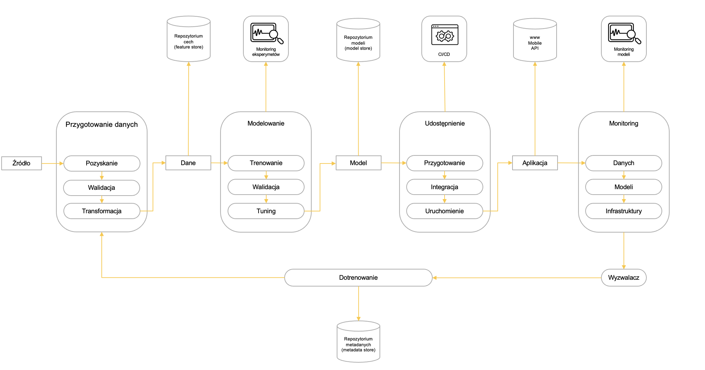
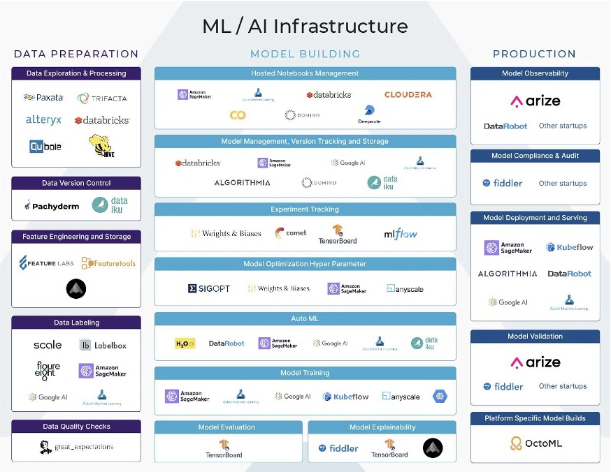

<iframe width="560" height="315" src="https://www.youtube.com/embed/IQo5p8-73ZY" title="YouTube video player" frameborder="0" allow="accelerometer; autoplay; clipboard-write; encrypted-media; gyroscope; picture-in-picture" allowfullscreen></iframe>

# **Motywacja**

Trening modelu uczenia maszynowego to dopiero początek: wcześniej trzeba pozyskać i przygotować dane, następnie go udostępnić, a po udostępnieniu monitorować jego jakość**.** 

W tym „cyklu życia modelu” pracujemy z wieloma komponentami i artefaktami:

1. Komponenty „przetwarzają” dane, są najczęściej skryptami komputerowymi (lub modułami dostępnymi w formie kontenerów)
2. Artefakty są produktami i/lub materiałem wejściowym dla komponentów

Przykładowe komponenty to: przygotowanie danych, modelowanie, udostępnianie, monitoring, dotrenowanie… Przykładowe artefakty zas to: dane, modele, aplikacje

Komponenty też nie są proste… Składa się na nie najczęściej wiele różnych, złożonych działań.

Artefakty zaś wymagają składowania w dedykowanych strukturach, takich jak:

1. Repozytoria cech (features stores)
2. Repozytoria modeli (model stores)
3. Repozytoria metadanych (metadata stores)

Całość trzeba przy tym: 

1. monitorować:

   1. Jakość i charakterystyki danych (np. dryf danych)

   1. Wyniki eksperymentów

   1. Jakość modeli (np. dryf modeli)

2. … kontrolować 

   1. Kontrola przebiegu procesu
   2. Zarządzanie parametrami przebiegów… 

3. i wersjonować

   1. Dane
   2. Modele.

Dane zadanie/proces ML może być realizowane:

1. Na różne sposoby
2. Z wykorzystaniem różnych bibliotek i różnych narzędzi
3. W różnych środowiskach (lokalnie, serwery w chmurze, chmura bezserwerowa, urządzenia mobilne.

Źródło: https://ai-infrastructure.org/maximizing-ml-infrastructure-tools-for-production-workloads-arize-ai/

Na szczęście, pomaga nam w tym wiele różnych bibliotek i narzędzi. Krajobraz ten szybko się zmienia.
