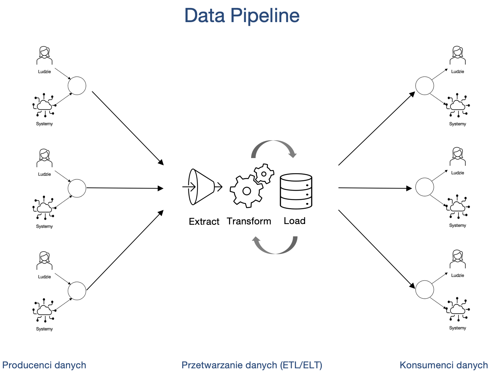

<iframe width="560" height="515" src="https://www.youtube.com/embed/7n6jCy0ZtQw" title="YouTube video player" frameborder="0" allow="accelerometer; autoplay; clipboard-write; encrypted-media; gyroscope; picture-in-picture" allowfullscreen></iframe>

# Potoki danych

Na typową architekturę IT składają się producenci danych, ich konsumenci i system je przetwarzające.

Kluczowe pytania, na które warto odpowiedzieć projektując architekturę IT, to:

1. Skąd pozyskamy dane?
2. W jaki sposób je pozyskamy? W jaki sposób będziemy je przetwarzać? Jak je będziemy gromadzić?
3. Dokąd te dane później trafią?

Najważniejsze powody, dla których warto projektować architektury IT, to:

1. Rozwiązanie klasycznych problemów z danymi, takich jak:
   1. zmieniające się schematy baz i scenariusze użycia
   2. rosnąca ilość danych
   3. błędy w danych
   4. duplikacja danych
   5. wycieki danych
   6. opóźnienia (latencja)
   7. awarie w procesach
   8. konieczność manualnego zarządzania procesami IT.
2. Integracja silosów informacyjnych często obecnych w firmach (osobne systemy wspomagające komunikację, zarządzanie różnymi obszarami działania, etc.)