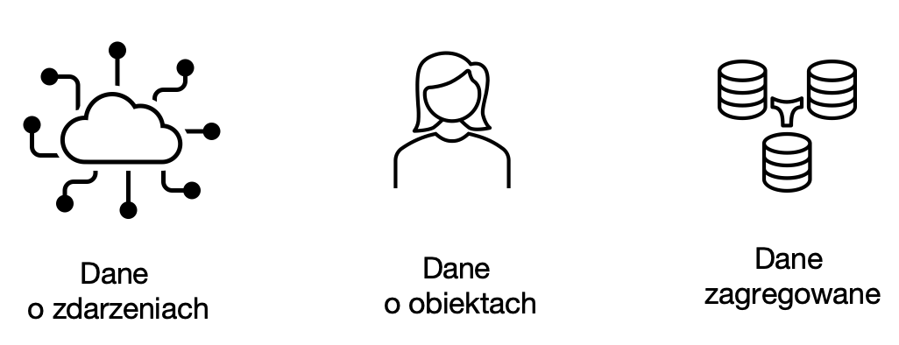
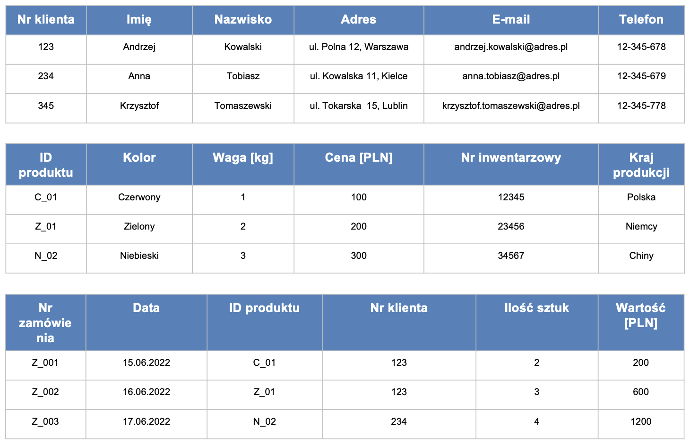
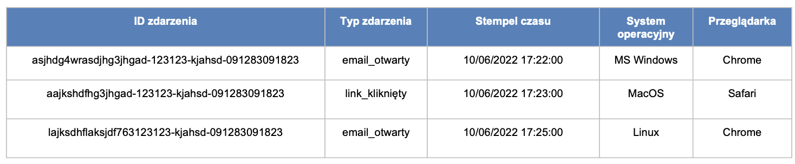
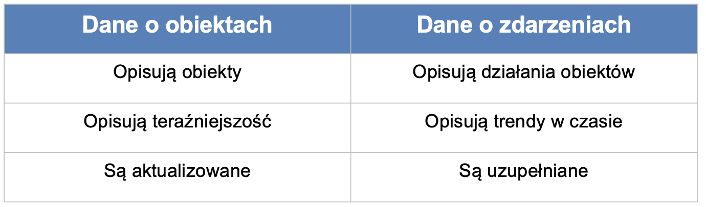
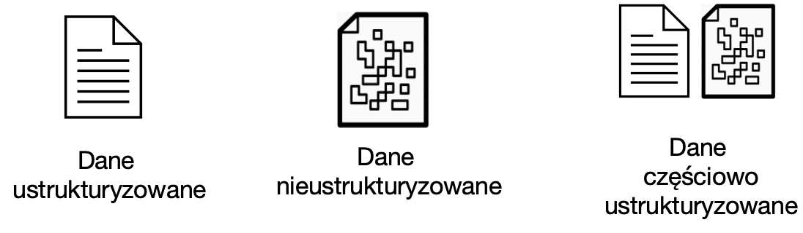

<iframe width="560" height="515" src="https://www.youtube.com/embed/9L1DqHCdsdY" title="YouTube video player" frameborder="0" allow="accelerometer; autoplay; clipboard-write; encrypted-media; gyroscope; picture-in-picture" allowfullscreen></iframe>

# Typy danych

Najważniejsze typy danych, które napotkamy w projektach uczenia maszynowego, to:

1. Dane o zdarzeniach, obiektach i ich agregaty
2. Dane ustrukturyzowane, nieustrukturyzowane i częściowo-ustrukturyzowane.

**Dane o obiektach** (ang. entity data) przedstawiają najczęściej stan obiektu, np. użytkownika, produktu, zamówienia. 

**Dane o zdarzeniach** (ang. event data) opisują działania wykonywane przez (lub na) obiektach. 

Najbardziej typowe cechy takich zdarzeń to:

- identyfikator
- typ zdarzenia
- znacznik czasu
- informacje uzupełniające. 

Warto podkreślić, że współczesne systemy generują zdecydowanie więcej danych o zdarzeniach niż danych o podmiotach (na każdego użytkownika korzystającego z aplikacji mogą przypadać tysiące zdarzeń).

Dane o zdarzeniach mogą być **agregowane** np. w celu analiz biznesowych (np. KPIs). Przykładowo, często wykorzystywane w biznesie miary będące wynikiem agregacji danych o obiektach i wydarzeniach to:

1. Liczba aktywnych użytkowników
     Dzienni aktywni użytkownicy (DAU)
     Tygodniowi aktywni użytkownicy (WAU)
     Miesięczna liczba aktywnych użytkowników (MAU)
2. Długość sesji
     Czas spędzony przez użytkownika korzystającego z Twojej aplikacji podczas jednej sesji.
3. Współczynnik kliknięć (CTR)
     Stosunek liczby użytkowników, którzy kliknęli na reklamę lub banner do liczby użytkowników, którzy obejrzeli stronę z tą reklamą lub bannerem.
4. Współczynnik odrzuceń (BR)
     Procent użytkowników opuszczających witrynę po obejrzeniu tylko jednej strony.
5. Współczynnik konwersji (CR)
     Procent użytkowników, którzy wykonują pożądaną akcję. 

Relację pomiędzy danymi o zdarzeniach i obiektach można podsumować następująco:

Kolejną istotną w uczeniu maszynowym charakterystyką danych jest ich podział na dane ustrukturyzowane, częściowo-ustrukturyzowane i nieustrukturyzowane. 

**Dane ustrukturyzowane**:

1. Są uporządkowane w tabelach
2. Można określić między nimi relacje
3. Można odpytywać korzystając z języka SQL (Structured Query Language)
4. Wymagają wskazania schematu (Schema): sposobu organizacji danych.

**Dane częściowo-ustrukturyzowane**:

1. Nie są zgodne z relacyjnymi bazami danych, takimi jak Excel czy SQL, ale mają pewien poziom organizacji, np. znaczniki.

2. Nie są ściśle relacyjne

3. Po przetworzeniu mogą być przechowywane w: 
   1. relacyjnych bazach danych
   2. bazach NoSQL
   3. plikach CSV, XML i JSON.

**Dane nieustrukturyzowane**:

1. Najczęściej dane jakościowe
2. Nie posiadają schematu/modelu, czy też relacji
3. Można je składować w bazach NoSQL i jeziorach danych

4. Przykłady: pliki audio, video, dokumenty tekstowe, wpisy na forach dyskusyjnych, etc.

