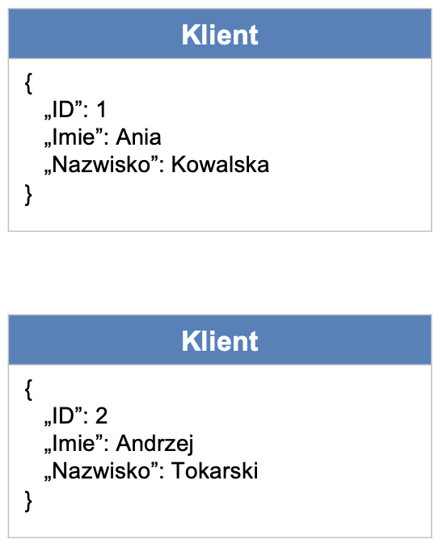
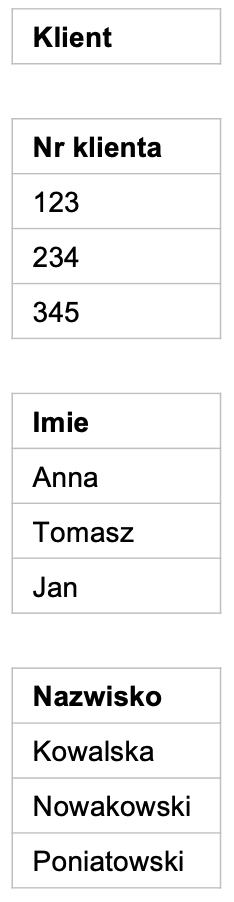
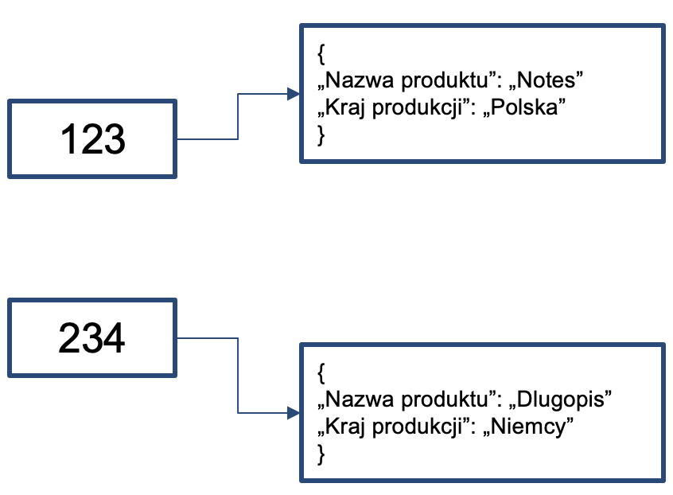
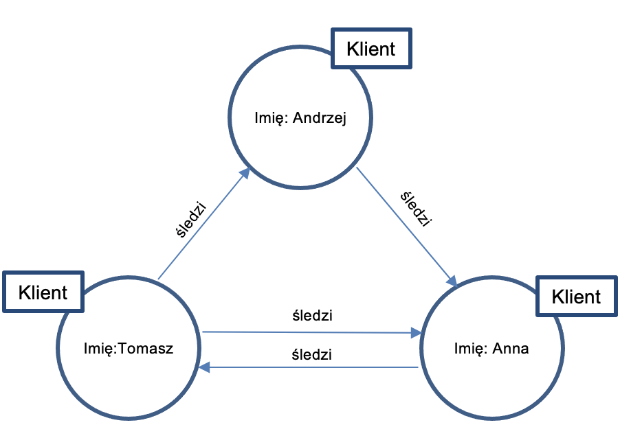

<iframe width="560" height="515" src="https://www.youtube.com/embed/PX12hNFXRgM" title="YouTube video player" frameborder="0" allow="accelerometer; autoplay; clipboard-write; encrypted-media; gyroscope; picture-in-picture" allowfullscreen></iframe>

# Bazy danych

Technologie gromadzenia danych powinny być dostosowane do ich typu.

## Bazy SQL

**Dane ustrukturyzowane**

1. Uporządkowane w tabelach
2. Można określić między nimi relacje
3. Można odpytywać językiem SQL (Structured Query Language)
4. Wymagają wskazania schematu (Schema): sposobu organizacji danych
5. W efekcie, gromadzimy najczęściej w bazach SQL.

Kluczową technologią w tego typu systemach jest OLTP (OnLine Transaction Processing). 

Przykładowe bazy SQL: Oracle, MS SQL Server, MySQL, PostgreSQL

Przykładowe zastosowania: systemy finansowe, transakcyjne, ERP, etc.

## Bazy NoSQL

Bazy NoSQL służą do przechowywania **danych nieustrukturyzowanych**. 

Wyróżniamy 4 podstawowe typy baz NoSQL.

1. Bazy zorientowane na dokumenty
2. Bazy kolumnowe
3. Bazy oparte o wartości kluczy (key-value)
4. Bazy grafowe.

---

**Bazy zorientowane na dokumenty:**

1. Nie posiadają ustalonego schematu
2. Dane składowane w dokumentach JSON (JavaScript Object Notation)
3. Każdy dokument może mieć inny zestaw pól
4. Przykładowe bazy: MongoDB, CouchDB, DocumentDB
5. Przykładowe zastosowania: systemy zarządzania dokumentami.

---

**Bazy kolumnowe**

1. Dane składowane są w nich w kolumnach (nie w wierszach)
2. W efekcie, operacje (zapytania, dodawanie, kasowanie, etc.) oparte na kolumnach działają 
w nich bardzo szybko
3. Przykładowe bazy: Cassandra
4. Przykładowe zastosowania: zaawansowane analizy danych.

---

**Bazy oparte o wartości kluczy (key-value)**

1. Każdy wpis ma w nich unikatowy klucz
2. Efekt: umożliwiają szybszy zapis i odczyt danych
3. Przykładowe bazy: Redis, Amazon Dynamo DB
4. Przykładowe zastosowania: opinie klientów.

---

**Bazy grafowe**

1. Dane skladowane w formie sieci

2. Koncentracja na połączeniach (relacjach) pomiędzy punktami (obiektami)

3. Wykorzystywane w analizach relacji

4. Przykładowe bazy: Neo4j, Inifinite Graph

5. Przykładowe zastosowania: analiza sieci społecznych.

