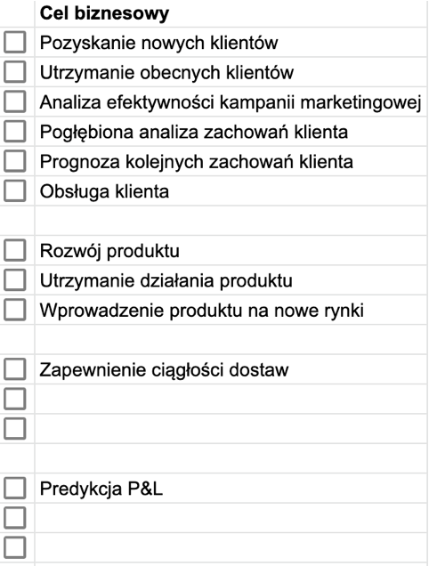
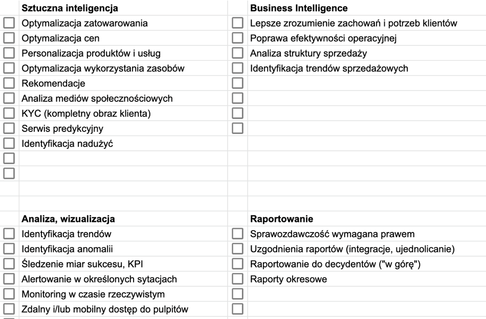

<iframe width="560" height="515" src="https://www.youtube.com/embed/O-vSumf7jRk" title="YouTube video player" frameborder="0" allow="accelerometer; autoplay; clipboard-write; encrypted-media; gyroscope; picture-in-picture" allowfullscreen></iframe>

# Konsumenci danych

Analizę potrzeb, która będzie podstawą dla projektu architektury systemu IT/uczenia maszynowego, warto rozpocząć od zbadania potrzeb użytkowników końcowych (konsumentów danych), podstawowych celów biznesowych i typowych scenariuszy użycia.

Kluczowe **pytania**, które warto zadać na tym etapie, to:

1. W jaki sposób konsument danych chce z nich korzystać? Do raportowania, tworzenia wizualizacji, podejmowania decyzji, a może do budowania modeli Machine Learning (ML)?

2. Jakie narzędzia są aktualnie używane przez użytkowników? Microsoft Excel, Tableau, Microsoft Power BI lub Google Data Studio?

3. Czy istnieją jakieś standardy w ramach danej grupy użytkowników? Dział prawny może potrzebować danych w innej postaci niż księgowość czy finanse.

Możliwe **cele biznesowe** to:

Najbardziej typowe **scenariusze użycia**:

