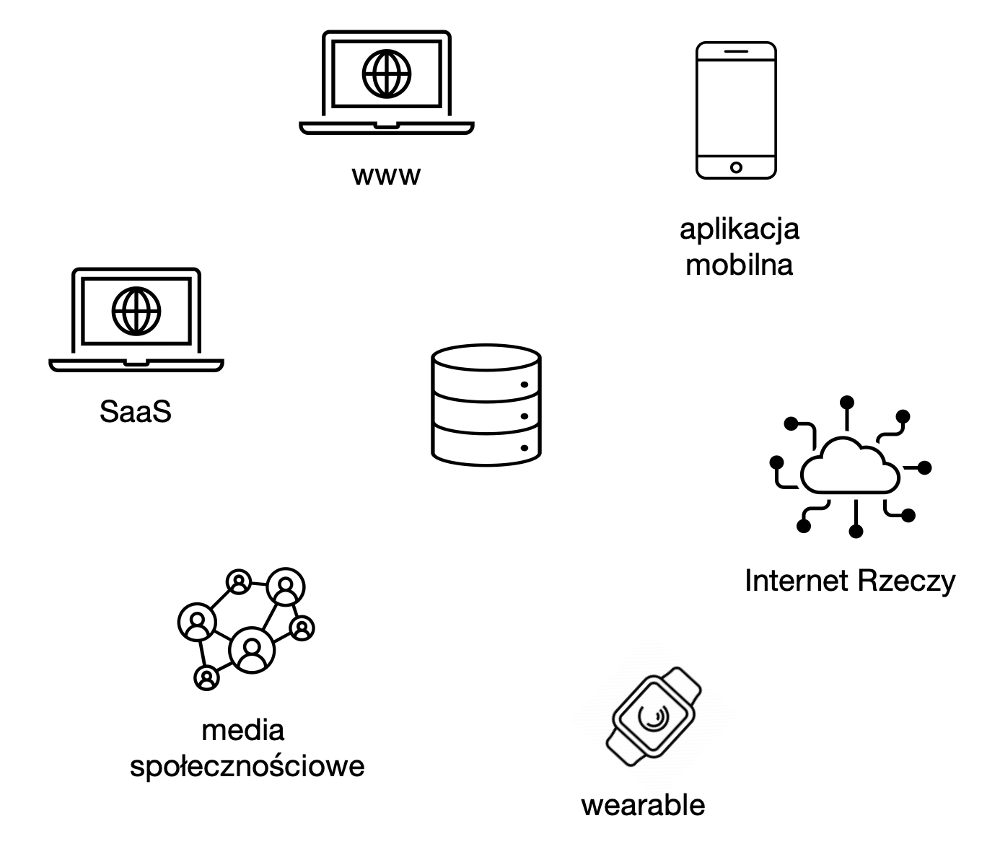
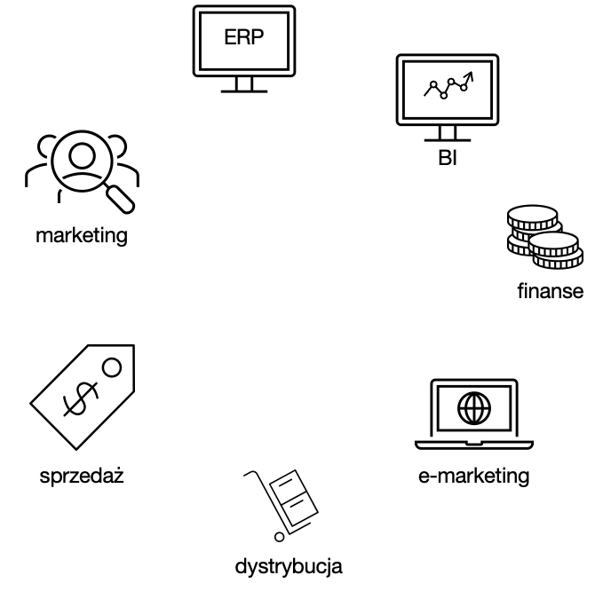

<iframe width="560" height="515" src="https://www.youtube.com/embed/7LlxcqJlM2A" title="YouTube video player" frameborder="0" allow="accelerometer; autoplay; clipboard-write; encrypted-media; gyroscope; picture-in-picture" allowfullscreen></iframe>

# Producenci danych

Typowe źródła **danych o zdarzeniach** to:

1. Strony www generujące dane o zachowaniach użytkownika:
   1. Pobrania
   2. Kliknięcia
   3. Wypełnienie formularza
   4. Komentarze
2. Media społecznościowe:
   1. Publikacja wpisu
   2. Udostępnienie obiektu (wpis, zdjecie, film, …)
   3. Polubienie obiektu
   4. Hashtag
   5. Wystawienie opinii
3. Systemy IT, generujące sygnały takie jak:
   1. Replikacja danych
   2. Synchronizacja danych
   3. Uruchomienie zadania
   4. Wykasowanie zadania, etc.
4. Sensory, np.
   1. Detektory ruchu
   2. Detektory głosu
   3. Detektory temperatury
   4. Detektory dymu, etc.

---

Typowe źródła **danych o obiektach** to:

1. Systemy transakcyjne i dziedzinowe (ERP, CRM, etc.)
2. Bazy danych

3. Hurtownie danych

4. Pliki i (rozproszone) systemy plików

5. Źródła zewnętrzne, API (Application Programming Interface).

