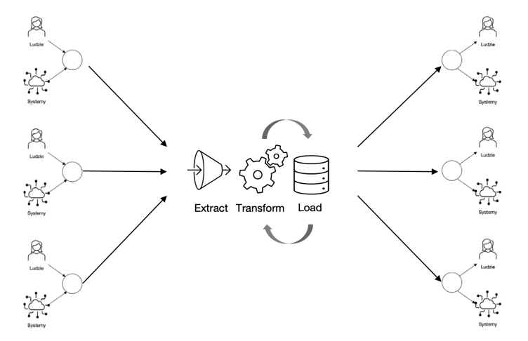
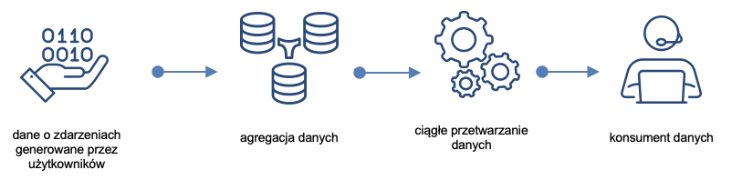
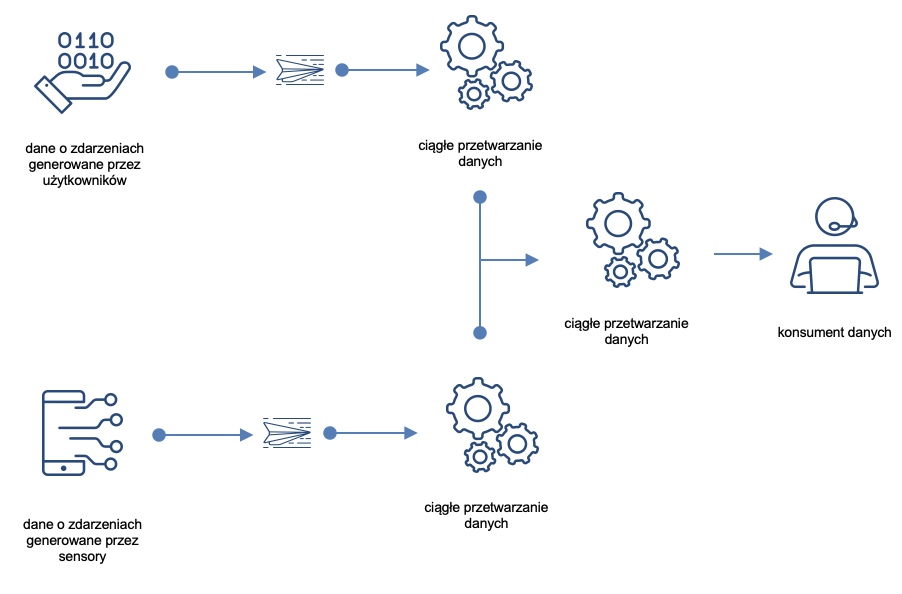

<iframe width="560" height="515" src="https://www.youtube.com/embed/ZIVfafy4dyA" title="YouTube video player" frameborder="0" allow="accelerometer; autoplay; clipboard-write; encrypted-media; gyroscope; picture-in-picture" allowfullscreen></iframe>

# Transformacja danych

Dane pozyskane ze źródeł są najczęściej przetwarzana na dwa różne sposoby:

1. ETL: Extract > Transform > Load
2. ELT: Extract > Load > Transform.

## Przetwarzanie ETL (Extract, Transform, Load)

**Ekstrakcja danych** (ang. extract) to czynność lub proces pobierania danych ze źródeł danych w celu ich dalszego przetwarzania lub przechowywania.

**Transformacja danych**  (ang. Transform) to zbiór reguł lub funkcji stosowanych do pozyskanych danych w celu przygotowania ich do załadowania do docelowego systemu.

**Ładowanie danych**  (ang. load) polega na przekazaniu danych do docelowego magazynu: płaskiego pliku, bazy czy hurtowni.

Dane mogą być przetwarzane **wsadowo** lub **w sposób ciągły (strumieniowe)**.

---

**Przetwarzanie wsadowe** (ang. batch processing) polega na jednoczesnym przetwarzaniu dużej ilości danych.

---

**Przetwarzanie strumieniowe** (stream processing) odbywa się w czasie zbliżonym do rzeczywistego - dane są przetwarzane w miarę ich napływu. Przykłady: przetwarzanie płatności i wykrywanie oszustw.

Wyzwania związane ze stosowaniem przetwarzania ETL:

Zbyt dużo danych. 

1. Ilość danych generowanych rośnie
2. Programy służące do transformacji mogą liczyć miliony linii. Może to bardzo utrudnić skalowanie potoku ETL.

3. Przekształcanie wszystkich danych przed ich załadowaniem może być zbyteczne. Przykładowo może się okazać, że nie ma potrzeby przetwarzania wszystkich danych o zdarzeniach generowanych na stronie internetowej jednocześnie. 

Różne typy danych

1. Różne typy danych (ustruktyrozowane, nie ustruktyryzowane, o obiektach czy zdarzeniach) wymagają różnych metod transformacji.
2. ETL najlepiej sprawdza się w przypadku ustrukturyzowanych danych o obiektach (structured, entity).

---

W efekcie, ETL warto stosować, w sytuacji, gdy dysponujemy dużą ilości ustrukturyzowanych danych transakcyjnych.

## Przetwarzanie ELT (Extract, Load, Transform)

W przetwarzaniu ELT:

1. dane **różnego typu** (ustrukturyzowane, nieustrukturyzowane lub częściowo ustrukturyzowane)
2. pobierane są z różnych źródeł danych
3. a następnie ładowane do magazynu danych, np. jeziora danych.

Transformacja następuje po załadowaniu do jeziora, po czym przetransformowane dane przekazywane są do dalszego wykorzystania przez ich konsumentów.

**Wyzwania** przetwarzania ELT:

1. Są drogie:
   1. Dużo danych różnego typu
   2. Wymagają skalowalności
   3. Wymagają dużych zasobów (składowanie, przetwarzanie)
2. Odpowiednie technologie są stosunkowo nowe:
   1. i w efekcie mogą być mniej niezawodne niż ETL
   2. trudno w związku z tym o specjalistów
   3. i trudniej zapewnić bezpieczeństwo.

ELT **warto stosować**:

1. Gdy gromadzimy duże ilości danych
2. Nie ma możliwości przetwarzać ich przed załadowaniem
3. Dane są nieustrukturyzowane lub mieszane. 

Przykładowe zastosowania: dane do analizy sentymentu (opinie, e-mail’e, gwiazdki), dane z logów systemowych, etc.